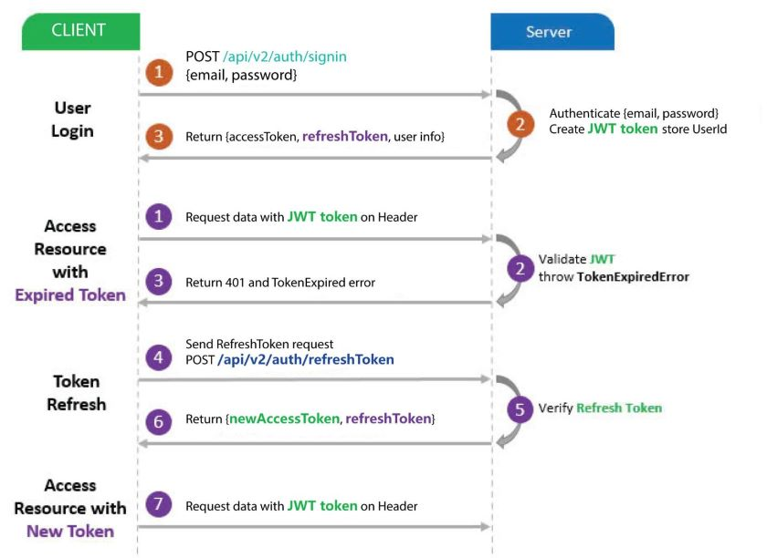
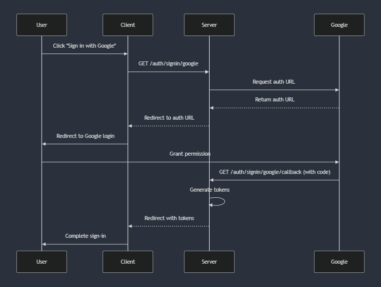

# Authentication & Authorization Documentation

## 1. JWT-Based Authentication

This API uses `jsonwebtoken` for authentication. When users sign in, a JWT access token is generated and sent back to the client through `Authorization` header to authorize future requests. A refresh token is also created to allow users to request a new access token without needing to log in again.

-   Access Token: Used to authenticate API requests, expires after a short period.
-   Refresh Token: A long-lived token stored in the database, hashed using SHA-256 before storage for security. It is used to generate new access tokens when the old ones expire.

The following diagram illustrates the authentication flow:



**Note:** Route `POST /api/v2/auth/refreshToken/reset` is used to reset refresh token which is optional. Client can let the user to sign in again to get new refresh token.

## 2. User Sign-In Flow:

The flow for users signing up and signing in to retrieve protected resources is as follows:

1.  Sign Up: `POST /api/v2/auth/signup`

    Creates a new account for the user. An email with a verification code will be sent to the user's email address.

2.  Verify Account: `POST /api/v2/auth/verify`

    The user must verify their account using the verification code sent to their email address.

3.  Sign In: `POST /api/v2/auth/signin`

    After account verification, the user signs in to receive an access token and refresh token. The access token is used to access protected resources. If account is not verified, the user will not be able to sign in.

## 3. Google Sign-In:

The API supports signing up or signing in with Google. This enables users to use their Google accounts to authenticate.

### Google Sign-In Flow:

1.  Redirect to Google:` GET /auth/google`

    The client is redirected to Google's sign-in page to authenticate the user.

2.  Grant Access:

    After the user gives access to their Google account, they will be redirected back to the application with an access token and a refresh token in the URL.

3.  Account Creation/Sign-In:

    If the user has not created an account yet, a new account is created using their Google profile information. A verification email is sent, but the access token and refresh token are still included in the redirect URL (they cannot be used until the account is verified).

    If the user already has an account and it is verified, the tokens are sent back without requiring a password.

The following diagram illustrates the Google Sign-in flow:



## 4. JWT Configuration:

The JWT configuration is stored in the `.env` file. The following variables are used:

-   **SECRET_KEY**: Secret key used to sign the access token.
-   **SECRET_REFRESH_KEY**: Secret key used to sign the refresh token.
-   **TOKEN_LIFE**: The lifespan of the access token (e.g., 1h for one hour).
-   **REFRESH_TOKEN_LIFE**: The lifespan of the refresh token (e.g., 7d for seven day)

Example:

```env
SECRET_KEY=your_secret_key
SECRET_REFRESH_KEY=your_refresh_secret_key
TOKEN_LIFE=1h
REFRESH_TOKEN_LIFE=7d
```

## 5. Google Sign-In Configuration:

To enable Google OAuth, you need to create credentials in the Google Developer Console. Below are the steps to configure it:

### Steps to Create Google OAuth Credentials:

1. Go to the Google Cloud Console.

2. Create a new project (or select an existing one).

3. Navigate to APIs & Services → Credentials.

4. Click on Create Credentials → OAuth 2.0 Client IDs.

5. Configure the Authorized redirect URIs to include the URLs where users will be redirected after signing in. For example:

    - `http://localhost:3000/auth/google/callback`

    - Your production client URLs should also be included here.

6. Save the credentials and note down the `Client ID` and `Client Secret`.

Or, you can follow this artice [Guide to using OAuth 2.0 Google](https://medium.com/@tony.infisical/guide-to-using-oauth-2-0-to-access-google-apis-dead94d6866d).

### Google OAuth Environment Variables:

After configuring Google OAuth Credentials, add the following variables to your `.env` file:

-   **GOOGLE_CLIENT_ID**: The client ID from Google credentials.

-   **GOOGLE_CLIENT_SECRET**: The client secret from Google credentials.

-   **GOOGLE_REDIRECT_URL**: The URL where Google should redirect after successful sign-in (this should be the URL where your client is hosted).

-   **GOOGLE_REDIRECT_URL_FAILED**: The URL where Google should redirect after sign-in failure (similar to the above URL).

Example:

```env
GOOGLE_CLIENT_ID=your_google_client_id
GOOGLE_CLIENT_SECRET=your_google_client_secret
GOOGLE_REDIRECT_URL=http://localhost:3000/auth/google/callback
GOOGLE_REDIRECT_URL_FAILED=http://localhost:3000/auth/google/failed
```
