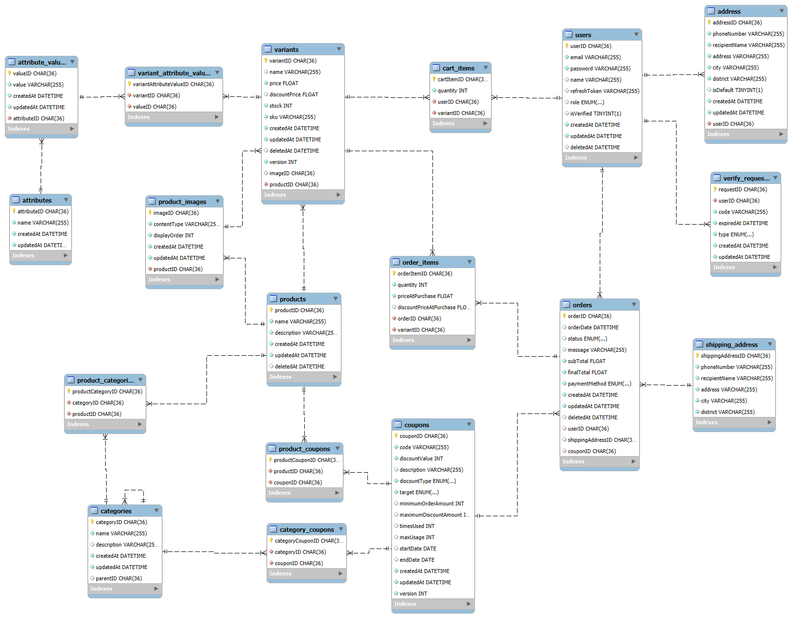
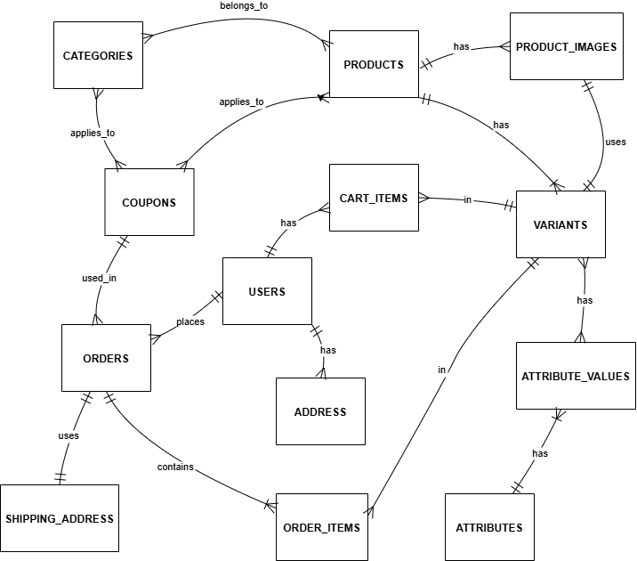

# Database Documentation

## Table of Contents

1. [Introduction](#introduction)
2. [Schema Overview](#schema-overview)
3. [Entity-Relationship Diagram](#entity-relationship-diagram)
4. [Critical Relationships](#critical-relationships)
5. [Design Decisions](#design-decisions)
6. [Table Descriptions](#table-descriptions)

## Introduction

This document provides an overview of the database schema used in our e-commerce API application. The schema is designed to support a robust e-commerce platform, managing users, products, orders, and related functionalities.

## Schema Overview

The database schema consists of the following tables:

## Entity-Relationship Diagram

The entity-relationship diagram (ERD) below illustrates the relationships between the tables in the database schema:

## Critical Relationships

-   Users → Orders → Order Items → Variants → Products: This chain represents the core business flow from user to purchased product.
-   Products ↔ Categories: Many-to-many relationship allowing products to belong to multiple categories.
-   Variants ↔ Attribute Values: Flexible association allowing detailed product variant descriptions.
-   Coupons → Products/Categories/Orders: Multiple pathways for applying discounts, maximizing promotional flexibility.

## Design Decisions

The database schema is designed to support the following features:

1. **UUID Usage**:

    - All tables use CHAR(36) UUID as primary keys, ensuring uniqueness across distributed systems and simplifying potential future data migration or merging.

2. **Flexible Product Structure**:

    - `Products` can have multiple variants, allowing for diverse product offerings (e.g., different sizes, colors).
    - `Attribute` and `Attribute Value` tables enable dynamic product characteristics without altering the core product structure.
    - Supports scaling to accommodate new product types (e.g., `laptops`) with unique attributes (e.g., `RAM`, `storage`).

3. **Hierarchical Categories**:

    - `Categories` table includes a self-referencing foreign key (parentID), supporting multi-level product categorization.

4. **Comprehensive Order Management**:

    - `Order Item` tables has `PriceAtPurchase` and `DiscountPriceAtPurchase` fields to maintain historical pricing information.
    - Dedicated `Shipping Address` table provides flexibility in order fulfillment processes.

5. **Versatile Coupon System**:

    - Designed to support various types of promotions (product-specific, category-wide, or order-level discounts).
    - Includes fields for usage limits, validity periods, and discount types.

6. **User Address Management**:

    - Separate `Address` table allows users to maintain multiple addresses.
    - `isDefault` field enables quick access to a user's primary address.

7. **Soft Delete Implementation**:

    - Inclusion of `deletedAt` fields in key tables (Users, Products, Orders) supports data recovery and maintains referential integrity.

8. **Cart As Wishlist**:
    - `Cart_Items` table serves as a wishlist, allowing users to save items for future purchase. Users can create orders from cart items.

## Table Descriptions

The following sections provide detailed descriptions of each table in the database schema, including the column names, data types, and descriptions.

### Users

| Column Name  | Data Type    | Description                                 |
| ------------ | ------------ | ------------------------------------------- |
| userID       | CHAR(36)     | Unique identifier for each user             |
| email        | VARCHAR(255) | User's email address                        |
| password     | VARCHAR(255) | Hashed password                             |
| name         | VARCHAR(255) | User's full name                            |
| refreshToken | VARCHAR(255) | Token for authentication                    |
| role         | ENUM         | User's role in the system (`user`, `admin`) |
| isVerified   | TINYINT(1)   | Boolean indicating if the user is verified  |
| createdAt    | DATETIME     | Timestamp of user creation                  |
| updatedAt    | DATETIME     | Timestamp of last update                    |
| deletedAt    | DATETIME     | Timestamp of user deletion, if applicable   |

### Address

| Column Name   | Data Type    | Description                                    |
| ------------- | ------------ | ---------------------------------------------- |
| addressID     | CHAR(36)     | Unique identifier for each address             |
| userID        | CHAR(36)     | Foreign key referencing Users table            |
| recipientName | VARCHAR(255) | Name of the recipient                          |
| address       | VARCHAR(255) | Street address                                 |
| city          | VARCHAR(255) | City name                                      |
| district      | VARCHAR(255) | District or state                              |
| isDefault     | TINYINT(1)   | Boolean indicating if it's the default address |
| createdAt     | DATETIME     | Timestamp of address creation                  |
| updatedAt     | DATETIME     | Timestamp of last update                       |

### Products

| Column Name | Data Type    | Description                                  |
| ----------- | ------------ | -------------------------------------------- |
| productID   | CHAR(36)     | Unique identifier for each product           |
| name        | VARCHAR(255) | Product name                                 |
| description | VARCHAR(255) | Product description                          |
| createdAt   | DATETIME     | Timestamp of product creation                |
| updatedAt   | DATETIME     | Timestamp of last update                     |
| deletedAt   | DATETIME     | Timestamp of product deletion, if applicable |

### Variants

| Column Name   | Data Type    | Description                                  |
| ------------- | ------------ | -------------------------------------------- |
| variantID     | CHAR(36)     | Unique identifier for each variant           |
| name          | VARCHAR(255) | Variant name                                 |
| price         | FLOAT        | Regular price                                |
| discountPrice | FLOAT        | Discounted price, if applicable              |
| stock         | INT          | Available stock quantity                     |
| sku           | VARCHAR(255) | Stock Keeping Unit                           |
| createdAt     | DATETIME     | Timestamp of variant creation                |
| updatedAt     | DATETIME     | Timestamp of last update                     |
| deletedAt     | DATETIME     | Timestamp of variant deletion, if applicable |
| version       | INT          | Version number                               |
| imageID       | CHAR(36)     | Foreign key referencing Product_Images table |
| productID     | CHAR(36)     | Foreign key referencing Products table       |

### Attributes

| Column Name | Data Type    | Description                          |
| ----------- | ------------ | ------------------------------------ |
| attributeID | CHAR(36)     | Unique identifier for each attribute |
| name        | VARCHAR(255) | Attribute name                       |
| createdAt   | DATETIME     | Timestamp of attribute creation      |
| updatedAt   | DATETIME     | Timestamp of last update             |

### Attribute_Values

| Column Name | Data Type    | Description                                |
| ----------- | ------------ | ------------------------------------------ |
| valueID     | CHAR(36)     | Unique identifier for each attribute value |
| value       | VARCHAR(255) | The attribute value                        |
| createdAt   | DATETIME     | Timestamp of value creation                |
| updatedAt   | DATETIME     | Timestamp of last update                   |
| attributeID | CHAR(36)     | Foreign key referencing Attributes table   |

### Variant_Attribute_Values

| Column Name | Data Type | Description                                    |
| ----------- | --------- | ---------------------------------------------- |
| variantID   | CHAR(36)  | Foreign key referencing Variants table         |
| valueID     | CHAR(36)  | Foreign key referencing Attribute_Values table |

### Product_Images

| Column Name  | Data Type    | Description                            |
| ------------ | ------------ | -------------------------------------- |
| imageID      | CHAR(36)     | Unique identifier for each image       |
| contentType  | VARCHAR(255) | Type of image file                     |
| displayOrder | INT          | Order for displaying images            |
| createdAt    | DATETIME     | Timestamp of image upload              |
| updatedAt    | DATETIME     | Timestamp of last update               |
| productID    | CHAR(36)     | Foreign key referencing Products table |

### Categories

| Column Name | Data Type    | Description                                              |
| ----------- | ------------ | -------------------------------------------------------- |
| categoryID  | CHAR(36)     | Unique identifier for each category                      |
| name        | VARCHAR(255) | Category name                                            |
| description | VARCHAR(255) | Category description                                     |
| createdAt   | DATETIME     | Timestamp of category creation                           |
| updatedAt   | DATETIME     | Timestamp of last update                                 |
| parentID    | CHAR(36)     | Self-referencing foreign key for hierarchical categories |

### Product_Categories

| Column Name       | Data Type | Description                              |
| ----------------- | --------- | ---------------------------------------- |
| productCategoryID | CHAR(36)  | Unique identifier                        |
| categoryID        | CHAR(36)  | Foreign key referencing Categories table |
| productID         | CHAR(36)  | Foreign key referencing Products table   |

### Coupons

| Column Name           | Data Type    | Description                                     |
| --------------------- | ------------ | ----------------------------------------------- |
| couponID              | CHAR(36)     | Unique identifier for each coupon               |
| code                  | VARCHAR(36)  | Coupon code                                     |
| discountValue         | INT          | Discount amount                                 |
| description           | VARCHAR(255) | Coupon description                              |
| discountType          | ENUM         | Type of discount (`fixed`, `percentage`)        |
| target                | ENUM         | Target for coupon application (`all`, `single`) |
| minimumOrderAmount    | INT          | Minimum order amount for coupon validity        |
| maximumDiscountAmount | INT          | Maximum discount allowed                        |
| usageLimit            | INT          | Maximum number of times the coupon can be used  |
| usageCount            | INT          | Number of times the coupon has been used        |
| startDate             | DATE         | Coupon validity start date                      |
| endDate               | DATE         | Coupon validity end date                        |
| createdAt             | DATETIME     | Timestamp of coupon creation                    |
| updatedAt             | DATETIME     | Timestamp of last update                        |
| version               | INT          | Version number                                  |

### Product_Coupons

| Column Name     | Data Type | Description                            |
| --------------- | --------- | -------------------------------------- |
| productCouponID | CHAR(36)  | Unique identifier                      |
| productID       | CHAR(36)  | Foreign key referencing Products table |
| couponID        | CHAR(36)  | Foreign key referencing Coupons table  |

### Category_Coupons

| Column Name      | Data Type | Description                              |
| ---------------- | --------- | ---------------------------------------- |
| categoryCouponID | CHAR(36)  | Unique identifier                        |
| categoryID       | CHAR(36)  | Foreign key referencing Categories table |
| couponID         | CHAR(36)  | Foreign key referencing Coupons table    |

### Orders

| Column Name       | Data Type    | Description                                                                                         |
| ----------------- | ------------ | --------------------------------------------------------------------------------------------------- |
| orderID           | CHAR(36)     | Unique identifier for each order                                                                    |
| orderDate         | DATETIME     | Date and time of the order                                                                          |
| status            | ENUM         | Current status of the order (`pending`, `awaiting payment`, `processing`, `delivered`, `cancelled`) |
| message           | VARCHAR(255) | Any additional message or notes                                                                     |
| subTotal          | FLOAT        | Subtotal amount of the order                                                                        |
| finalTotal        | FLOAT        | Final total amount after discounts                                                                  |
| paymentMethod     | ENUM         | Method of payment                                                                                   |
| createdAt         | DATETIME     | Timestamp of order creation                                                                         |
| updatedAt         | DATETIME     | Timestamp of last update                                                                            |
| deletedAt         | DATETIME     | Timestamp of order deletion, if applicable                                                          |
| userID            | CHAR(36)     | Foreign key referencing Users table                                                                 |
| shippingAddressID | CHAR(36)     | Foreign key referencing Address table                                                               |
| couponID          | CHAR(36)     | Foreign key referencing Coupons table                                                               |

### Order_Items

| Column Name             | Data Type | Description                               |
| ----------------------- | --------- | ----------------------------------------- |
| orderItemID             | CHAR(36)  | Unique identifier for each order item     |
| quantity                | INT       | Quantity of the item ordered              |
| priceAtPurchase         | FLOAT     | Price of the item at the time of purchase |
| discountPriceAtPurchase | FLOAT     | Discounted price at the time of purchase  |
| orderID                 | CHAR(36)  | Foreign key referencing Orders table      |
| variantID               | CHAR(36)  | Foreign key referencing Variants table    |

### Cart_Items

| Column Name | Data Type | Description                            |
| ----------- | --------- | -------------------------------------- |
| cartItemID  | CHAR(36)  | Unique identifier for each cart item   |
| quantity    | INT       | Quantity of the item in the cart       |
| userID      | CHAR(36)  | Foreign key referencing Users table    |
| variantID   | CHAR(36)  | Foreign key referencing Variants table |

### Verify_Requests

| Column Name | Data Type    | Description                                                   |
| ----------- | ------------ | ------------------------------------------------------------- |
| requestID   | CHAR(36)     | Unique identifier for each request                            |
| userID      | CHAR(36)     | Foreign key referencing Users table                           |
| code        | VARCHAR(255) | Verification code                                             |
| expiresAt   | DATETIME     | Expiration date and time of the request                       |
| type        | ENUM         | Type of verification request (`verifyEmail`, `resetPassword`) |
| createdAt   | DATETIME     | Timestamp of request creation                                 |
| updatedAt   | DATETIME     | Timestamp of last update                                      |

### Shipping_Address

| Column Name       | Data Type    | Description                                 |
| ----------------- | ------------ | ------------------------------------------- |
| shippingAddressID | CHAR(36)     | Unique identifier for each shipping address |
| phoneNumber       | VARCHAR(255) | Contact phone number                        |
| recipientName     | VARCHAR(255) | Name of the recipient                       |
| address           | VARCHAR(255) | Detail address                              |
| city              | VARCHAR(255) | City name                                   |
| district          | VARCHAR(255) | District or state                           |
